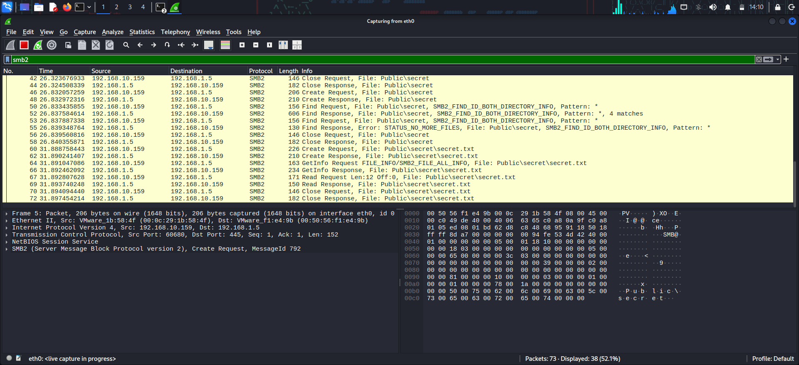
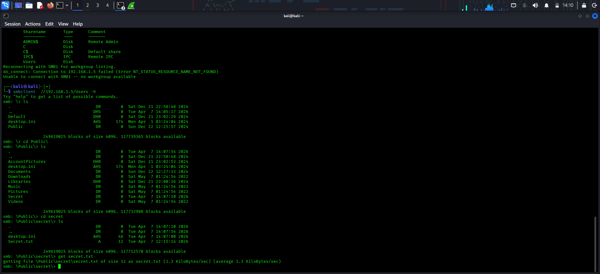
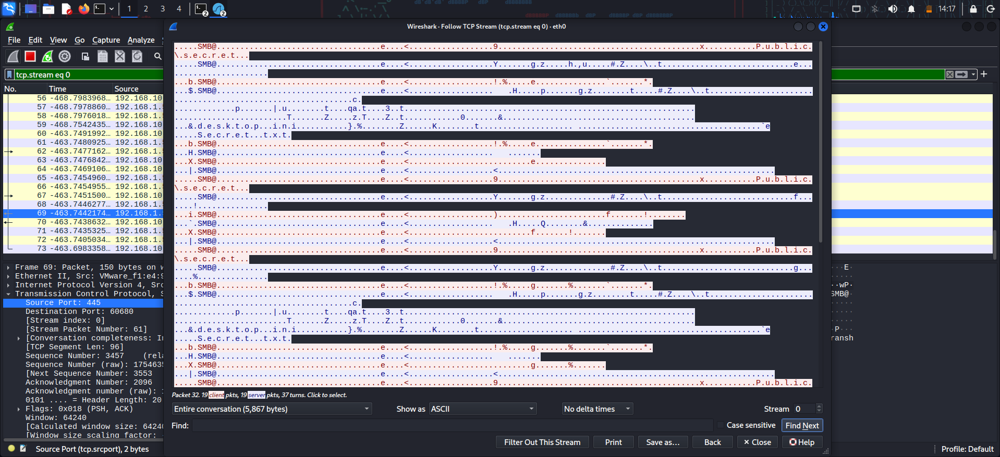
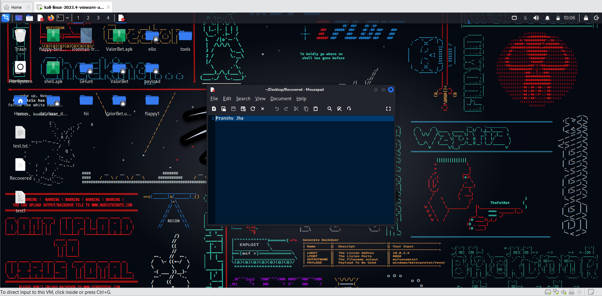

# 🔍 SMB Traffic Analysis & Data Recovery

## 🧠 Overview

This project demonstrates how sensitive files can be recovered from network traffic by analyzing SMB protocol communication.

It simulates a real-world scenario where file data is transmitted over a network and can be intercepted and reconstructed using packet analysis techniques.

---

## 🎯 Objective

To analyze SMB traffic and demonstrate how file data can be extracted from captured network packets.

---

## ⚙️ Tools Used

* Kali Linux
* Wireshark
* SMB Protocol

---

## 🧱 Lab Setup

* Local network environment
* SMB shared directory configured
* File placed inside shared folder
* Traffic captured using Wireshark

---

## 📡 Methodology

### 1. Traffic Capture

Wireshark was used to capture SMB traffic on the network interface.

### 2. Packet Analysis

SMB2 packets were filtered and analyzed to identify file-related operations such as:

* Create Request
* Read Request
* Read Response

### 3. Data Extraction

File data was extracted from network traffic using packet analysis techniques.

---

### SMB Traffic Capture

### File Access Detection

### TCP Stream Analysis

### Recovered File

---

## 💥 Result

Successfully demonstrated that file data can be recovered from SMB network traffic under certain conditions.

---

## ⚠️ Security Insight

Unencrypted network protocols can expose sensitive data, making traffic analysis a critical aspect of cybersecurity.

---

## 🛡️ Mitigation

* Enable SMB encryption
* Use secure network channels (VPN)
* Restrict unnecessary file sharing
* Monitor network traffic

---

## 🎯 Conclusion

This project highlights the importance of securing network communications and demonstrates how attackers can leverage packet analysis to recover sensitive information.

---
